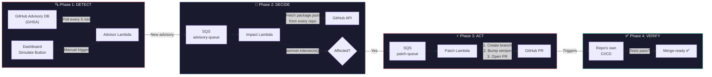
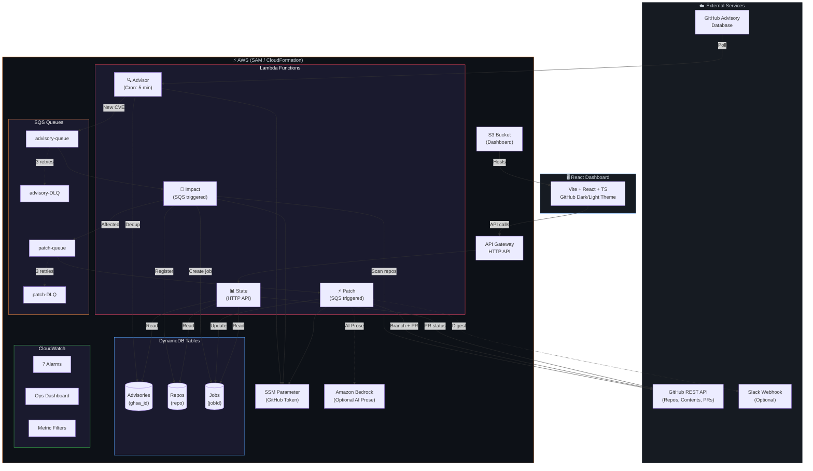
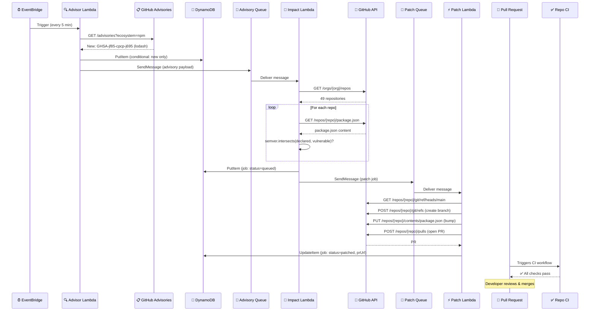

<p align="center">
  
  
  
  
  
</p>

<h1 align="center">🛡️ Sentinel</h1>

<p align="center">
  <strong>Advisory-first, org-wide npm dependency security automation for GitHub.</strong><br/>
  <em>One security event → org-wide impact analysis → coordinated remediation PRs.</em>
</p>

<p align="center">
  <a href="#-how-it-works">How It Works</a> •
  <a href="#-architecture">Architecture</a> •
  <a href="#-quickstart">Quickstart</a> •
  <a href="#-dashboard">Dashboard</a> •
  <a href="#-configuration">Configuration</a>
</p>

---

> **Dependabot is per-repo. Sentinel is org-wide.**
>
> When a zero-day like Log4j or a lodash prototype-pollution drops, Dependabot tells each repo _individually_ — eventually. **Sentinel tells you the org-wide blast radius _instantly_**, and opens coordinated remediation PRs across every affected repo in minutes.

---


## 💡 The Problem

You're a security lead at a company with **50+ Node.js repositories**. A critical CVE drops for `lodash`. You need to know:

1. **Which repos are affected?** → Manual search across 50 repos? _Hours._
2. **Are we using the vulnerable version?** → Check every `package.json`? _Painful._
3. **Can we patch automatically?** → Open PRs everywhere? _Dependabot does it per-repo, slowly._
4. **What's our blast radius?** → _No single view exists._

**Sentinel answers all of this in under 60 seconds.** One event, one scan, one coordinated response.

---

## 🔄 How It Works

Sentinel operates in **4 phases** — Detect → Decide → Act → Verify:



### Phase-by-phase breakdown

| Phase | What happens | Key file |
|:---:|:---|:---|
| **🔍 Detect** | EventBridge triggers every 5 min. Advisor Lambda polls GitHub's Security Advisory API for new npm CVEs. Deduplicates via DynamoDB conditional writes. | `backend/advisor.mjs` |
| **🧠 Decide** | Impact Lambda receives the advisory via SQS. Fetches **every repo** in your org, reads each `package.json`, and runs `semver.intersects(declaredRange, vulnerableRange)`. Respects per-repo `.github/sentinel.json` exclusion policies. | `backend/impact.mjs` |
| **⚡ Act** | Patch Lambda creates a `security/{pkg}-{ghsa_id}` branch, bumps the exact version in `package.json`, and opens a PR with full advisory context. Labels it `security` + `sentinel`. Assigns reviewers from repo policy. | `backend/patch.mjs` |
| **✅ Verify** | The repo's own GitHub Actions CI runs on the PR automatically. Dashboard tracks merge status in real time. Optional Slack digest when all jobs settle. | Repo's CI + `backend/state.mjs` |

---

## 🏗️ Architecture



---

## 📊 What a Run Looks Like

When advisory `GHSA-jf85-cpcp-j695` (lodash prototype pollution, **high severity**) is detected:

```
┌─────────────────────────────────────────────────────────────────────┐
│  🔍 DETECT                                                         │
│  ADVISORY GHSA-jf85-cpcp-j695 lodash high                         │
│  "Prototype Pollution in lodash"                                   │
└──────────────────────────────┬──────────────────────────────────────┘
                               ▼
┌─────────────────────────────────────────────────────────────────────┐
│  🧠 DECIDE                                                         │
│  Scanning 49 repositories...                                       │
│  ✓ sentinel-demo-service — lodash@^4.17.20 → AFFECTED             │
│  · AgriVision-Ai — no package.json → skipped                      │
│  · Amazon-Prime-Clone — lodash not declared → unaffected           │
│  · ...47 more repos scanned                                        │
│                                                                     │
│  ADVISORY GHSA-jf85-cpcp-j695: 1 of 49 repos affected             │
└──────────────────────────────┬──────────────────────────────────────┘
                               ▼
┌─────────────────────────────────────────────────────────────────────┐
│  ⚡ ACT                                                             │
│  Branch: security/lodash-GHSA-jf85-cpcp-j695                       │
│  Commit: chore(security): bump lodash to 4.17.21                   │
│  PR #1 created: https://github.com/ANSUJKMEHER/                    │
│                 sentinel-demo-service/pull/1                        │
│  Labels: [security, sentinel]                                      │
└──────────────────────────────┬──────────────────────────────────────┘
                               ▼
┌─────────────────────────────────────────────────────────────────────┐
│  ✅ VERIFY                                                          │
│  Repo CI triggered automatically on the PR                          │
│  PR merged ✓                                                        │
│  Dashboard updated: status = 🟣 Merged                              │
└─────────────────────────────────────────────────────────────────────┘
```

The PR body includes:
- 📋 Full advisory details (severity, GHSA link, affected range)
- 📊 Before/after version table
- 🤖 Optional AI-generated plain-language explanation (via Amazon Bedrock)
- 🏷️ Auto-applied `security` and `sentinel` labels

---

## 🖥️ Dashboard

The Sentinel dashboard is a React + TypeScript app with a **GitHub-native dark/light theme**:

<!-- Replace these with actual screenshots -->
<!--  -->
<!--  -->

### Dashboard Features

| Tab | What it shows |
|:---|:---|
| **Overview** | Stat cards (repos, advisories, PRs), severity breakdown, recent remediations with live PR status |
| **Advisories** | Every CVE Sentinel has processed, with severity badges, package names, and recommended actions |
| **Repos** | All 49+ org repos with their scan status, policy exclusions, and last-seen timestamps |
| **Jobs** | Every remediation job with status (Queued → Patched → Merged), PR links, and error details |
| **Simulate** | Fire a test advisory to validate the end-to-end pipeline without waiting for a real CVE |

---

## 🚀 Quickstart

### Prerequisites

- **Node.js 20+** and **npm**
- **Docker** (for LocalStack local development)
- **GitHub Personal Access Token** with `repo` scope
- (Production) **AWS CLI** + **SAM CLI**

### Local Development (Recommended for trying it out)

```bash
# 1. Clone and install
git clone https://github.com/ANSUJKMEHER/Sentinel.git
cd Sentinel
npm install

# 2. Run tests (67 unit tests)
npm test

# 3. Start LocalStack (DynamoDB + SQS + SSM)
docker compose up -d

# 4. Provision local AWS resources
node scripts/deploy-local.ps1    # Windows
# OR
./scripts/deploy-local.sh        # macOS/Linux

# 5. Start the dev servers (backend API + Vite dashboard)
node scripts/dev-server.mjs &    # API on :4100
npm run dashboard:dev             # Dashboard on :5173

# 6. Open http://localhost:5173 — you'll see the dashboard!
```

### Run a Full Simulation

```bash
# Set up a demo repo with a vulnerable package.json
node scripts/setup-demo-repo.mjs

# Run the full pipeline: advisory → impact → patch → PR
node scripts/run-full-simulation.mjs
```

### Production Deployment (AWS)

```bash
# Deploy the full SAM stack to AWS
SENTINEL_GITHUB_TOKEN=<your-pat> ./scripts/deploy.sh <your-org> dev

# The stack creates:
# - 4 Lambda functions (advisor, impact, patch, state)
# - 3 DynamoDB tables
# - 4 SQS queues (2 primary + 2 DLQs)
# - API Gateway + S3 dashboard
# - 7 CloudWatch alarms + ops dashboard
```

---

## ⚙️ Configuration

### Environment Variables

| Variable | Default | Description |
|:---|:---|:---|
| `GITHUB_ORG` | — | GitHub org or username to monitor |
| `GITHUB_TOKEN` (SSM) | — | PAT stored as SecureString in SSM |
| `AUTO_REMEDIATE_SEVERITIES` | `critical,high` | Comma-separated list; others are report-only |
| `BEDROCK_ENABLED` | `false` | Enable AI-generated PR prose |
| `BEDROCK_MODEL_ID` | `amazon.nova-lite-v1:0` | Bedrock model for PR summaries |
| `NOTIFY_WEBHOOK_URL` | — | Slack-compatible webhook for digests |

### Per-Repo Policy (`.github/sentinel.json`)

Any repo can opt out or customize its remediation behavior:

```json
{
  "exclude": false,
  "excludePackages": ["lodash"],
  "reviewers": ["octocat", "security-team"],
  "labels": ["urgent", "auto-security"]
}
```

| Field | Type | Effect |
|:---|:---|:---|
| `exclude` | `boolean` | Skip this repo entirely |
| `excludePackages` | `string[]` | Skip specific packages in this repo |
| `reviewers` | `string[]` | Auto-request reviewers on remediation PRs |
| `labels` | `string[]` | Additional labels beyond `security`/`sentinel` |

---

## 🧪 Testing

```bash
# Run all 67 unit tests
npm test

# Run the smoke test (end-to-end validation)
npm run smoke
```

Test coverage includes:
- **`decisions.test.mjs`** — Semver range intersection, version bumping, severity gating, repo config parsing
- **`handlers.test.mjs`** — All 4 Lambda handlers with mocked DynamoDB/SQS/GitHub
- **`policy.test.mjs`** — Per-repo exclusion rules and policy parsing
- **`prbody.test.mjs`** — PR body composition, marker idempotency, advisory grouping
- **`report.test.mjs`** — Weekly rollup aggregation, merge/stale classification

---

## 🆚 Sentinel vs Dependabot

| Capability | Dependabot | Sentinel |
|:---|:---:|:---:|
| **Scope** | Per-repo | **Org-wide** |
| **Trigger** | Repo-level scan schedule | **Real-time advisory event** |
| **Blast radius visibility** | ❌ No | ✅ **Instant** |
| **Unified dashboard** | ❌ No | ✅ **Yes** |
| **Per-repo policies** | Limited | ✅ **Full control** |
| **PR grouping** | ❌ No | ✅ **Multiple advisories per PR** |
| **Severity gating** | Limited | ✅ **Configurable** |
| **Slack/webhook notifications** | ❌ No | ✅ **Advisory digest** |
| **AI-generated PR context** | ❌ No | ✅ **Amazon Bedrock** |
| **Weekly security report** | ❌ No | ✅ **GET /report** |
| **Self-hosted** | ❌ GitHub-managed | ✅ **Your AWS account** |

---

## 🛠️ Tech Stack

| Layer | Technology | Purpose |
|:---|:---|:---|
| **Runtime** | Node.js 20, ESM | Lambda handlers + dashboard |
| **Infrastructure** | AWS SAM / CloudFormation | IaC for all resources |
| **Compute** | AWS Lambda (×4) | Serverless event processing |
| **Messaging** | Amazon SQS (×4) | Decoupled async pipeline with DLQs |
| **Storage** | Amazon DynamoDB (×3) | Advisories, repos, and job state |
| **API** | Amazon API Gateway HTTP API | RESTful dashboard backend |
| **Secrets** | AWS SSM Parameter Store | GitHub token (SecureString) |
| **Frontend** | React 18 + TypeScript + Vite | Real-time dashboard |
| **Observability** | CloudWatch + X-Ray | Alarms, metrics, tracing |
| **AI (Optional)** | Amazon Bedrock (Nova Lite) | PR body prose generation |
| **CI/CD** | GitHub Actions | Unit tests + SAM validation |
| **Local Dev** | LocalStack + Docker Compose | Full offline development |
| **Core Logic** | `semver` npm package | Vulnerability range matching |

---

## 📁 Project Structure

```
sentinel/
├── backend/                    # Lambda functions + business logic
│   ├── advisor.mjs             # 🔍 Advisory detection (cron)
│   ├── impact.mjs              # 🧠 Org-wide impact analysis
│   ├── patch.mjs               # ⚡ PR creation engine
│   ├── state.mjs               # 📊 Dashboard API (GET /state, /report, POST /simulate)
│   ├── decisions.mjs           # 🎯 Core semver logic (pure, tested)
│   ├── github.mjs              # 🔗 GitHub API client with retry
│   ├── bedrock.mjs             # 🤖 Optional AI prose
│   ├── notify.mjs              # 📬 Slack digest
│   ├── report.mjs              # 📈 Weekly rollup
│   ├── logger.mjs              # 📝 Structured JSON logging
│   ├── smoke.mjs               # 🧪 Smoke test
│   └── *.test.mjs              # ✅ 67 unit tests
├── src/                        # React dashboard
│   ├── App.tsx                 # Main app with tab navigation
│   ├── components/
│   │   ├── OverviewView.tsx    # Overview tab with stat cards
│   │   ├── AdvisoriesTable.tsx # CVE listing with severity badges
│   │   ├── ReposTable.tsx      # Org repo registry
│   │   ├── JobsTable.tsx       # Remediation job tracker
│   │   └── SimulatePanel.tsx   # Manual advisory simulation
│   ├── services/api.ts         # API client
│   └── styles/                 # GitHub-themed CSS
├── scripts/                    # Deployment + dev tooling
│   ├── dev-server.mjs          # Local API proxy server
│   ├── deploy-local.ps1        # LocalStack provisioning (Windows)
│   ├── run-full-simulation.mjs # End-to-end pipeline runner
│   └── setup-demo-repo.mjs    # Create demo repo with vuln deps
├── docs/                       # Documentation
│   ├── context.md              # Project context & handoff
│   ├── AUDIT.md                # Phase-by-phase audit & roadmap
│   └── GITHUB_APP_SETUP.md    # GitHub App installation guide
├── template.yaml               # AWS SAM template (598 lines)
├── docker-compose.yml          # LocalStack config
├── .github/workflows/ci.yml   # CI pipeline
└── package.json                # Dependencies & scripts
```

---

## 📋 Sequence Diagram — Full Pipeline



---

## 🗺️ Roadmap (v2)

- [ ] **Lockfile analysis** — Detect transitive vulnerabilities via `package-lock.json`
- [ ] **Multi-ecosystem** — Extend beyond npm to PyPI, Maven, Go modules
- [ ] **Advisory webhooks** — Replace polling with GitHub webhook push events
- [ ] **Auto-merge** — Merge PRs automatically when CI passes and severity ≥ critical
- [ ] **GitHub App auth** — Replace PAT with GitHub App for higher rate limits
- [ ] **Multi-org** — Monitor multiple GitHub organizations from one deployment

---

## 📄 Documentation

| Document | Description |
|:---|:---|
| [`docs/context.md`](docs/context.md) | Project context, design decisions, and handoff notes |
| [`docs/AUDIT.md`](docs/AUDIT.md) | Phase-by-phase implementation audit and roadmap |
| [`docs/GITHUB_APP_SETUP.md`](docs/GITHUB_APP_SETUP.md) | GitHub App installation as an alternative to PAT |

---

## 🤝 Contributing

1. Fork the repository
2. Create a feature branch (`git checkout -b feature/amazing-feature`)
3. Run tests (`npm test`)
4. Commit your changes (`git commit -m 'Add amazing feature'`)
5. Push to the branch (`git push origin feature/amazing-feature`)
6. Open a Pull Request

---

## 📝 License

This project is developed as part of a hackathon/portfolio project by [@ANSUJKMEHER](https://github.com/ANSUJKMEHER).

---

<p align="center">
  <strong>🛡️ Sentinel — Because security incidents don't wait for per-repo scans.</strong>
</p>
